# System Requirement Specification (SRS)

**System Name:** National Youth Bridge Athlete Management System (NYBAMS)  
**Version:** 2.0  
**Last Updated:** 2026-05-29  
**Status:** Draft

---

## Table of Contents

1. [Introduction](#1-introduction)
2. [Overall Description](#2-overall-description)
3. [User Groups & Role-Based Access Control (RBAC)](#3-user-groups--role-based-access-control-rbac)
4. [Functional Requirements](#4-functional-requirements)
5. [Non-Functional Requirements](#5-non-functional-requirements)
6. [Database Schema](#6-database-schema)
7. [System Diagrams](#7-system-diagrams)
   - 7.1 System Architecture Diagram
   - 7.2 Use Case Diagram
   - 7.3 Entity Relationship Diagram (ERD)
   - 7.4 Sequence Diagrams
   - 7.5 Component Diagram
   - 7.6 Data Flow Diagram (DFD)
   - 7.7 Activity Diagrams
   - 7.8 State Diagrams
   - 7.9 Navigation & Sitemap Diagram
8. [API Endpoint Specification](#8-api-endpoint-specification)
9. [Constraints & Assumptions](#9-constraints--assumptions)
10. [Field Validation Rules](#10-field-validation-rules)
11. [Google Sheets Structure & Configuration](#11-google-sheets-structure--configuration)
12. [Docker & Deployment Configuration](#12-docker--deployment-configuration)
13. [Error Handling & HTTP Response Codes](#13-error-handling--http-response-codes)
14. [Environment Variables](#14-environment-variables)
15. [Testing Requirements](#15-testing-requirements)
16. [Project Folder Structure](#16-project-folder-structure)
17. [Changelog](#17-changelog)

---

## 1. Introduction

### 1.1 Purpose
เอกสารนี้กำหนดข้อกำหนดสำหรับ National Youth Bridge Athlete Management System (NYBAMS) ซึ่งเป็นแพลตฟอร์มเว็บสำหรับจัดการนักกีฬาบริดจ์เยาวชนทีมชาติ ครอบคลุมการจัดการข้อมูลนักกีฬา การเช็กชื่อ การลาซ้อม ปฏิทิน กิจกรรม และลิงก์การซ้อม

### 1.2 Scope
ระบบนี้พัฒนาสำหรับองค์กรกีฬาบริดจ์เยาวชนทีมชาติ โดยมีผู้ใช้งานหลัก 3 กลุ่ม ได้แก่ Super Admin, Coach และ Player

### 1.3 Definitions & Abbreviations

| คำย่อ / ศัพท์ | ความหมาย |
|---|---|
| NYBAMS | National Youth Bridge Athlete Management System |
| RBAC | Role-Based Access Control |
| SPA | Single Page Application |
| OAuth | Open Authorization |
| PK | Primary Key |
| FK | Foreign Key |
| CRUD | Create, Read, Update, Delete |
| Realbridge | แพลตฟอร์มออนไลน์สำหรับซ้อมกีฬาบริดจ์ |

---

## 2. Overall Description

### 2.1 System Overview
NYBAMS เป็น Web Application แบบ Single Page Application (SPA) พัฒนาด้วย Angular ทำงานบน Docker Container โดยใช้ Google Sheets เป็นฐานข้อมูลและ Google Drive สำหรับจัดเก็บไฟล์

### 2.2 Tech Stack

| Layer | Technology | Rationale |
|---|---|---|
| Frontend | Angular 17+ | SPA framework, TypeScript-based |
| Backend | Angular (Node.js API / Express) | Unified codebase |
| Database | Google Sheets API v4 | ฐานข้อมูลแบบ Spreadsheet |
| File Storage | Google Drive API v3 | จัดเก็บรูปภาพและเอกสาร |
| Authentication | Google OAuth 2.0 | ใช้ Google Account เข้าสู่ระบบ |
| Containerization | Docker + Docker Compose | Separate Frontend/Backend containers |
| Version Control | Git / GitHub | Source code management |

### 2.3 System Constraints
- ต้องใช้ Google Account ที่ลงทะเบียนไว้ในระบบเท่านั้น
- ระบบรองรับเฉพาะ Browser สมัยใหม่ (Chrome, Firefox, Edge, Safari)
- ขนาดไฟล์แนบสูงสุด 10 MB ต่อไฟล์

---

## 3. User Groups & Role-Based Access Control (RBAC)

### 3.1 User Roles

#### Super Admin
- มีสิทธิ์เข้าถึงและจัดการทุกส่วนของระบบ
- บริหารจัดการ User, Team, Practice Link และ Activity Feed
- อนุมัติ/ปฏิเสธการลาของทุกทีม
- เช็กชื่อนักกีฬาได้ทุกทีม

#### Coach
- ถูกกำหนดให้สังกัดอยู่ใน **1 ทีม** (team_id)
- เช็กชื่อนักกีฬาได้เฉพาะทีมของตัวเอง
- อนุมัติ/ปฏิเสธการลาได้เฉพาะทีมของตัวเอง
- สร้าง Event ใน Calendar ได้
- มองเห็น Coach Link และ Player Link ใน Practice

#### Player
- ถูกกำหนดให้สังกัดอยู่ใน **1 ทีม** (team_id)
- แก้ไขข้อมูลส่วนตัวของตัวเองได้ (บางฟิลด์)
- แจ้งลาซ้อมได้
- มองเห็นเฉพาะ Player Link ใน Practice
- ดู Calendar และ Activity Feed ได้

### 3.2 RBAC Matrix (สรุป)

| Feature / Page | Super Admin | Coach | Player |
|---|---|---|---|
| **Athlete Profile - View** | ทุกทีม | เฉพาะทีมตัวเอง | เห็นเฉพาะชื่อ/รูปของทุกคน |
| **Athlete Profile - Create** | ✅ | ❌ | ❌ |
| **Athlete Profile - Edit** | ✅ ทุกคน | ❌ | ✅ เฉพาะตัวเอง (บางฟิลด์) |
| **Athlete Profile - Delete** | ✅ | ❌ | ❌ |
| **ดูเบอร์โทร** | ✅ | ✅ เฉพาะทีมตัวเอง | ✅ เฉพาะตัวเอง |
| **ดูวันเกิด** | ✅ | ❌ | ✅ เฉพาะตัวเอง |
| **Attendance - เช็กชื่อ** | ✅ ทุกทีม | ✅ เฉพาะทีมตัวเอง | ❌ |
| **Attendance - ดูประวัติ** | ✅ ทุกทีม | ✅ เฉพาะทีมตัวเอง | ✅ เฉพาะตัวเอง |
| **Leave - แจ้งลา** | ❌ | ❌ | ✅ |
| **Leave - ดูสถานะลาตัวเอง** | ✅ | ✅ | ✅ |
| **Leave - อนุมัติ/ปฏิเสธ** | ✅ ทุกทีม | ✅ เฉพาะทีมตัวเอง | ❌ |
| **Calendar - ดู** | ✅ | ✅ | ✅ |
| **Calendar - สร้าง/แก้ไข/ลบ** | ✅ | ✅ เฉพาะที่ตัวเองสร้าง | ❌ |
| **Activity Feed - ดู** | ✅ | ✅ | ✅ |
| **Activity Feed - สร้าง/แก้ไข/ลบ** | ✅ | ❌ | ❌ |
| **Practice Links - จัดการ** | ✅ | ❌ | ❌ |
| **Practice Links - ดู Coach Link** | ✅ | ✅ เฉพาะทีมตัวเอง | ❌ |
| **Practice Links - ดู Player Link** | ✅ | ✅ | ✅ เฉพาะทีมตัวเอง |
| **Team Management** | ✅ | ❌ | ❌ |

---

## 4. Functional Requirements

### 4.1 Authentication & Authorization

**FR-AUTH-01:** ระบบต้องรองรับการเข้าสู่ระบบผ่าน Google OAuth 2.0 เท่านั้น  
**FR-AUTH-02:** ระบบต้องตรวจสอบว่า Google Account ที่ Login นั้นมีอยู่ใน Users table โดยใช้ `email` เป็น identifier หากไม่มีให้แสดงข้อความ "บัญชีนี้ไม่ได้รับอนุญาตให้เข้าใช้งานระบบ"  
**FR-AUTH-03:** ระบบต้องจัดการ Session Token และทำการ Logout เมื่อ Token หมดอายุ (ภายใน 8 ชั่วโมง)  
**FR-AUTH-04:** ระบบต้อง Redirect ผู้ใช้ไปยังหน้า Login ทันทีหาก Session หมดอายุหรือไม่มีสิทธิ์เข้าถึง  

### 4.2 Team Management (Super Admin Only)

**FR-TEAM-01:** Super Admin สามารถสร้างทีมใหม่ได้ โดยระบุชื่อทีมและคำอธิบาย  
**FR-TEAM-02:** Super Admin สามารถแก้ไขและลบทีมได้ (ลบได้เฉพาะทีมที่ไม่มีสมาชิก)  
**FR-TEAM-03:** ระบบต้องแสดงรายชื่อทีมทั้งหมดในรูปแบบ Dropdown สำหรับการ Assign User  

### 4.3 Athlete Profile Management

**FR-USER-01:** Super Admin สามารถสร้าง User ใหม่ได้ โดยกรอก email ที่ใช้งาน Google Account, role, team, และข้อมูลส่วนตัว  
**FR-USER-02:** Super Admin สามารถแก้ไขข้อมูล User ทุกคนได้  
**FR-USER-03:** Super Admin สามารถ Soft-Delete (Deactivate) User ได้ โดย User ที่ถูก Deactivate จะเข้าสู่ระบบไม่ได้  
**FR-USER-04:** Player สามารถแก้ไขข้อมูลส่วนตัวได้เฉพาะฟิลด์: `img_avatar_url`, `phone`, `email`  
**FR-USER-05:** ฟิลด์ `phone` แสดงได้เฉพาะ: เจ้าของข้อมูล, Coach ของทีมเดียวกัน, Super Admin  
**FR-USER-06:** ฟิลด์ `birth_date` แสดงได้เฉพาะ: เจ้าของข้อมูล, Super Admin  
**FR-USER-07:** ระบบต้องรองรับการอัปโหลดรูปประจำตัวไปยัง Google Drive และเก็บ URL ใน Users table  
**FR-USER-08:** หน้า Athlete Profile ต้องมี Search และ Filter ตาม Team  
**FR-USER-09:** ระบบต้องแสดงรายชื่อนักกีฬาแบบ Pagination (20 คน/หน้า)  

### 4.4 Attendance Tracking

**FR-ATT-01:** Coach และ Super Admin สามารถเข้าหน้าเช็กชื่อได้  
**FR-ATT-02:** Coach เห็นเฉพาะนักกีฬาในทีมของตัวเอง; Super Admin เลือกทีมได้จาก Dropdown  
**FR-ATT-03:** Status ที่เช็กได้: `Present` (มา), `Absent` (ขาด), `Leave` (ลา - ต้องมีคำขอลาที่อนุมัติแล้ว)  
**FR-ATT-04:** ระบบต้องบันทึก `checked_by` (ผู้เช็กชื่อ) และ `checked_at` (เวลาที่เช็ก)  
**FR-ATT-05:** ระบบต้องแสดงประวัติการเช็กชื่อย้อนหลัง สามารถ Filter ตามวันที่และทีมได้  
**FR-ATT-06:** หากมีการแจ้งลาที่อนุมัติแล้ว ระบบต้องแสดงสถานะ "ลา" อัตโนมัติใน Attendance  
**FR-ATT-07:** ระบบต้องป้องกันการเช็กชื่อซ้ำในวันเดียวกัน (Allow update เท่านั้น)  
**FR-ATT-08:** Player สามารถดูประวัติการเช็กชื่อของตัวเองได้ (Read-Only)  

### 4.5 Leave Request

**FR-LEAVE-01:** Player สามารถสร้างคำขอลาซ้อมได้ โดยระบุ: วันเริ่มลา, วันสิ้นสุดลา, สาเหตุ, หลักฐาน (Optional)  
**FR-LEAVE-02:** วันเริ่มลาต้องไม่ก่อนวันที่ปัจจุบัน  
**FR-LEAVE-03:** สถานะเริ่มต้นของคำขอลาคือ `Pending`  
**FR-LEAVE-04:** Player สามารถยกเลิกคำขอลาที่มีสถานะ `Pending` ได้  
**FR-LEAVE-05:** Player ไม่สามารถส่งคำขอลาซ้ำในช่วงวันที่มีคำขอลา `Pending` หรือ `Approved` อยู่แล้ว  
**FR-LEAVE-06:** ระบบต้องรองรับการอัปโหลดหลักฐานไปยัง Google Drive (ขนาดไม่เกิน 10 MB, รองรับ PDF, JPG, PNG)  
**FR-LEAVE-07:** Player สามารถดูประวัติคำขอลาทั้งหมดของตัวเองได้  

### 4.6 Leave Approval

**FR-APPV-01:** Coach และ Super Admin สามารถดูคำขอลาที่มีสถานะ `Pending` ได้  
**FR-APPV-02:** Coach เห็นเฉพาะคำขอลาของทีมตัวเอง; Super Admin เห็นทุกทีม  
**FR-APPV-03:** Coach และ Super Admin สามารถ `Approve` หรือ `Reject` คำขอลาได้  
**FR-APPV-04:** เมื่อ `Reject` ต้องระบุเหตุผล (`reject_reason`)  
**FR-APPV-05:** ระบบต้องบันทึก `action_by` และ `action_at` เมื่อมีการอนุมัติ/ปฏิเสธ  
**FR-APPV-06:** เมื่อมีการอนุมัติ/ปฏิเสธ ระบบต้องสร้าง Notification ให้ Player เจ้าของคำขอ  

### 4.7 Calendar

**FR-CAL-01:** ทุก User สามารถดู Calendar ได้  
**FR-CAL-02:** Calendar แสดง Event ในรูปแบบ Monthly, Weekly, และ Daily View  
**FR-CAL-03:** Coach และ Super Admin สามารถสร้าง Event ได้ โดยระบุ: Title, Description, Start Datetime, End Datetime, Color, All-Day flag, Team (Optional - ระบุทีมหรือ All Teams)  
**FR-CAL-04:** Super Admin แก้ไข/ลบ Event ได้ทุก Event; Coach แก้ไข/ลบได้เฉพาะ Event ที่ตัวเองสร้าง  
**FR-CAL-05:** ระบบต้องแสดง Event ที่กำหนดสำหรับทีมของ User หรือ All Teams เท่านั้น  
**FR-CAL-06:** คลิก Event เพื่อดูรายละเอียด  

### 4.8 Activity Feed

**FR-FEED-01:** ทุก User สามารถดู Activity Feed ได้  
**FR-FEED-02:** Super Admin สามารถสร้าง Feed Post ได้ โดยระบุ: Title, Date From, Date To, Location, Details, รูปภาพประกอบ (Optional)  
**FR-FEED-03:** Super Admin สามารถแก้ไขและลบ Feed Post ได้  
**FR-FEED-04:** ระบบแสดง Feed เรียงตามวันที่ล่าสุดก่อน  
**FR-FEED-05:** ระบบต้องมีระบบ Pagination หรือ Infinite Scroll สำหรับ Feed  

### 4.9 Practice Links

**FR-PRAC-01:** Super Admin สามารถเพิ่ม Practice Link ได้ โดยระบุ: วันที่ซ้อม, ทีม, Player Link, Coach Link, หมายเหตุ  
**FR-PRAC-02:** Super Admin สามารถแก้ไขและลบ Practice Link ได้  
**FR-PRAC-03:** Player เห็นเฉพาะ Player Link ของทีมตัวเอง  
**FR-PRAC-04:** Coach เห็นทั้ง Player Link และ Coach Link ของทีมตัวเอง  
**FR-PRAC-05:** Super Admin เห็น Link ทั้งหมดทุกทีม  
**FR-PRAC-06:** ระบบต้องย้าย Practice Link อัตโนมัติ (Auto-Archive) ไปยัง "Practice History" เมื่อผ่านวันที่ซ้อมไปแล้ว  
**FR-PRAC-07:** ระบบต้องแสดง Practice History แบบสามารถ Filter ตามวันที่และทีม  

### 4.10 Notification System (เพิ่มเติม)

**FR-NOTI-01:** ระบบต้องแสดง Notification Bell บน Navigation Bar  
**FR-NOTI-02:** Notification ต้องถูกสร้างในกรณีต่อไปนี้:
  - เมื่อคำขอลาถูกอนุมัติ/ปฏิเสธ → แจ้ง Player เจ้าของคำขอ
  - เมื่อมีคำขอลาใหม่ → แจ้ง Coach ของทีมนั้น และ Super Admin
  - เมื่อมี Activity Feed ใหม่ → แจ้งทุก User
  - เมื่อมี Practice Link ใหม่ → แจ้ง User ในทีมที่เกี่ยวข้อง  
**FR-NOTI-03:** Notification ต้องแสดงสถานะ `read` / `unread`  
**FR-NOTI-04:** User สามารถ Mark as Read ทั้งหมดได้  

---

## 5. Non-Functional Requirements

### 5.1 Performance
- **NFR-PERF-01:** หน้าเว็บต้องโหลดภายใน 3 วินาที บน Network ปกติ
- **NFR-PERF-02:** API Response Time ต้องไม่เกิน 2 วินาที สำหรับ Operation ปกติ

### 5.2 Security
- **NFR-SEC-01:** ทุก API Endpoint ต้องผ่านการ Authenticate ด้วย JWT Token
- **NFR-SEC-02:** ต้องมีการ Validate Role ทุก API Endpoint ฝั่ง Backend (ไม่พึ่ง Frontend เพียงอย่างเดียว)
- **NFR-SEC-03:** ข้อมูลที่ส่งระหว่าง Client-Server ต้องเข้ารหัสด้วย HTTPS
- **NFR-SEC-04:** ต้องมีการป้องกัน CORS และ CSRF

### 5.3 Usability
- **NFR-USE-01:** UI ต้องรองรับภาษาไทยและภาษาอังกฤษ
- **NFR-USE-02:** ระบบต้องรองรับ Responsive Design (Desktop, Tablet)
- **NFR-USE-03:** ต้องมี Loading State และ Error Message ที่ชัดเจน

### 5.4 Availability & Maintainability
- **NFR-AVAIL-01:** ระบบต้องรองรับ Uptime ≥ 95%
- **NFR-MAINT-01:** Code ต้อง Follow Angular Style Guide และ Clean Architecture

---

## 6. Database Schema

ใช้ **Google Sheets** เป็นฐานข้อมูล แบ่งเป็น **9 Tables (Sheets)** ดังนี้

---

### Table 1: `Teams`

| Column | Data Type | Constraints | Description |
|---|---|---|---|
| `team_id` | String | PK, Unique | รหัสทีม เช่น T001 |
| `team_name` | String | NOT NULL | ชื่อทีม เช่น Under-21, Women's Team |
| `description` | String | NULLABLE | คำอธิบายทีม |
| `is_active` | Boolean | DEFAULT TRUE | สถานะทีม |
| `created_at` | DateTime | NOT NULL | วันที่สร้าง |
| `updated_at` | DateTime | NOT NULL | วันที่แก้ไขล่าสุด |

---

### Table 2: `Users`

| Column | Data Type | Constraints | Description |
|---|---|---|---|
| `user_id` | String | PK, Unique | รหัส User เช่น U001 |
| `google_sub` | String | Unique, NOT NULL | Google OAuth Subject ID |
| `email` | String | Unique, NOT NULL | Email (ใช้สำหรับ Login) |
| `role` | Enum | NOT NULL | `Super Admin`, `Coach`, `Player` |
| `team_id` | String | FK → Teams.team_id | ทีมที่สังกัด |
| `img_avatar_url` | String | NULLABLE | URL รูปโปรไฟล์บน Google Drive |
| `th_prefix` | String | NULLABLE | คำนำหน้าชื่อ (ภาษาไทย) เช่น นาย, นางสาว |
| `en_prefix` | String | NULLABLE | Title Prefix (English) เช่น Mr., Ms. |
| `th_first_name` | String | NOT NULL | ชื่อ (ภาษาไทย) |
| `en_first_name` | String | NOT NULL | First Name (English) |
| `th_last_name` | String | NOT NULL | นามสกุล (ภาษาไทย) |
| `en_last_name` | String | NOT NULL | Last Name (English) |
| `phone` | String | NULLABLE | เบอร์โทรศัพท์ **(Restricted)** |
| `birth_date` | Date | NULLABLE | วันเกิด **(Restricted)** |
| `is_active` | Boolean | DEFAULT TRUE | สถานะ Account (Soft Delete) |
| `created_at` | DateTime | NOT NULL | วันที่สร้าง |
| `updated_at` | DateTime | NOT NULL | วันที่แก้ไขล่าสุด |
| `created_by` | String | FK → Users.user_id | ผู้สร้าง (Super Admin) |

> **หมายเหตุ:** `phone` — ดูได้เฉพาะ เจ้าของข้อมูล / Coach ทีมเดียวกัน / Super Admin  
> **หมายเหตุ:** `birth_date` — ดูได้เฉพาะ เจ้าของข้อมูล / Super Admin

---

### Table 3: `Attendance`

| Column | Data Type | Constraints | Description |
|---|---|---|---|
| `attendance_id` | String | PK, Unique | รหัสการเช็กชื่อ |
| `date` | Date | NOT NULL | วันที่ซ้อม |
| `player_id` | String | FK → Users.user_id | รหัสนักกีฬา |
| `team_id` | String | FK → Teams.team_id | รหัสทีม |
| `status` | Enum | NOT NULL | `Present`, `Absent`, `Leave` |
| `note` | String | NULLABLE | หมายเหตุเพิ่มเติม |
| `checked_by` | String | FK → Users.user_id | ผู้เช็กชื่อ |
| `checked_at` | DateTime | NOT NULL | เวลาที่เช็กชื่อ |
| `updated_at` | DateTime | NOT NULL | เวลาที่แก้ไขล่าสุด |

> **Unique Constraint:** (`date`, `player_id`) — ห้ามเช็กชื่อซ้ำในวันเดียวกัน

---

### Table 4: `LeaveRequests`

| Column | Data Type | Constraints | Description |
|---|---|---|---|
| `leave_id` | String | PK, Unique | รหัสคำขอลา |
| `player_id` | String | FK → Users.user_id | รหัสนักกีฬาผู้ขอลา |
| `team_id` | String | FK → Teams.team_id | รหัสทีม |
| `start_date` | Date | NOT NULL | วันเริ่มลา |
| `end_date` | Date | NOT NULL | วันสิ้นสุดลา |
| `reason` | String | NOT NULL | สาเหตุการลา |
| `evidence_url` | String | NULLABLE | URL หลักฐานบน Google Drive |
| `status` | Enum | DEFAULT `Pending` | `Pending`, `Approved`, `Rejected` |
| `reject_reason` | String | NULLABLE | เหตุผลในการปฏิเสธ (กรณี Reject) |
| `action_by` | String | FK → Users.user_id | ผู้อนุมัติ/ปฏิเสธ |
| `action_at` | DateTime | NULLABLE | เวลาที่ดำเนินการ |
| `created_at` | DateTime | NOT NULL | วันที่ส่งคำขอ |
| `updated_at` | DateTime | NOT NULL | วันที่แก้ไขล่าสุด |

---

### Table 5: `Events` (Calendar)

| Column | Data Type | Constraints | Description |
|---|---|---|---|
| `event_id` | String | PK, Unique | รหัส Event |
| `title` | String | NOT NULL | ชื่อ Event |
| `description` | String | NULLABLE | รายละเอียด |
| `start_datetime` | DateTime | NOT NULL | วันเวลาเริ่มต้น |
| `end_datetime` | DateTime | NOT NULL | วันเวลาสิ้นสุด |
| `is_all_day` | Boolean | DEFAULT FALSE | Event ทั้งวัน |
| `color` | String | DEFAULT `#4285F4` | สี Event (Hex Code) |
| `team_id` | String | FK → Teams.team_id, NULLABLE | ทีมที่เกี่ยวข้อง (NULL = ทุกทีม) |
| `created_by` | String | FK → Users.user_id | ผู้สร้าง |
| `created_at` | DateTime | NOT NULL | วันที่สร้าง |
| `updated_at` | DateTime | NOT NULL | วันที่แก้ไขล่าสุด |

---

### Table 6: `Activities` (Feed)

| Column | Data Type | Constraints | Description |
|---|---|---|---|
| `activity_id` | String | PK, Unique | รหัสกิจกรรม |
| `title` | String | NOT NULL | ชื่อกิจกรรม |
| `date_from` | Date | NOT NULL | วันเริ่มต้นกิจกรรม |
| `date_to` | Date | NOT NULL | วันสิ้นสุดกิจกรรม |
| `location` | String | NULLABLE | สถานที่ |
| `details` | String | NOT NULL | รายละเอียด |
| `img_url` | String | NULLABLE | URL รูปภาพประกอบบน Google Drive |
| `created_by` | String | FK → Users.user_id | ผู้สร้าง (Super Admin) |
| `created_at` | DateTime | NOT NULL | วันที่สร้าง |
| `updated_at` | DateTime | NOT NULL | วันที่แก้ไขล่าสุด |

---

### Table 7: `PracticeLinks`

| Column | Data Type | Constraints | Description |
|---|---|---|---|
| `link_id` | String | PK, Unique | รหัส Practice Link |
| `practice_date` | Date | NOT NULL | วันที่ซ้อม |
| `team_id` | String | FK → Teams.team_id, **NULLABLE** | รหัสทีม (NULL = ทุกทีมซ้อมร่วมกัน) |
| `section` | Integer | NOT NULL, DEFAULT 1 | ลำดับ Section ของการซ้อมในวันนั้น เช่น 1, 2, 3 |
| `player_link` | String | NOT NULL | Realbridge URL สำหรับ Player |
| `coach_link` | String | NULLABLE | Realbridge URL สำหรับ Coach |
| `note` | String | NULLABLE | หมายเหตุ |
| `is_archived` | Boolean | DEFAULT FALSE | ถูก Archive แล้วหรือไม่ |
| `created_by` | String | FK → Users.user_id | ผู้เพิ่ม Link (Super Admin) |
| `created_at` | DateTime | NOT NULL | วันที่สร้าง |
| `updated_at` | DateTime | NOT NULL | วันที่แก้ไขล่าสุด |

> **Unique Constraint:** (`practice_date`, `team_id`, `section`) — 1 วัน + 1 ทีม (หรือ All Teams) + 1 Section = 1 link เท่านั้น  
> **หมายเหตุ:** `team_id = NULL` หมายถึง Session ที่ **ทุกทีมซ้อมร่วมกัน** (All Teams joint session)

---

### Table 8: `Notifications` *(เพิ่มใหม่)*

| Column | Data Type | Constraints | Description |
|---|---|---|---|
| `notification_id` | String | PK, Unique | รหัส Notification |
| `user_id` | String | FK → Users.user_id | ผู้รับ Notification |
| `type` | Enum | NOT NULL | `leave_approved`, `leave_rejected`, `leave_new`, `feed_new`, `practice_new` |
| `title` | String | NOT NULL | หัวข้อ Notification |
| `message` | String | NOT NULL | เนื้อหา Notification |
| `ref_id` | String | NULLABLE | รหัสอ้างอิง (leave_id, activity_id ฯลฯ) |
| `is_read` | Boolean | DEFAULT FALSE | สถานะการอ่าน |
| `created_at` | DateTime | NOT NULL | วันที่สร้าง |

---

### Table 9: `AuditLog` *(เพิ่มใหม่)*

| Column | Data Type | Constraints | Description |
|---|---|---|---|
| `log_id` | String | PK, Unique | รหัส Log |
| `user_id` | String | FK → Users.user_id | ผู้ดำเนินการ |
| `action` | String | NOT NULL | การกระทำ เช่น `CREATE_USER`, `APPROVE_LEAVE` |
| `target_table` | String | NOT NULL | ตารางที่เกี่ยวข้อง |
| `target_id` | String | NULLABLE | รหัสข้อมูลที่เกี่ยวข้อง |
| `old_value` | String (JSON) | NULLABLE | ค่าเดิม (JSON) |
| `new_value` | String (JSON) | NULLABLE | ค่าใหม่ (JSON) |
| `ip_address` | String | NULLABLE | IP ของผู้ดำเนินการ |
| `created_at` | DateTime | NOT NULL | วันที่และเวลา |

---

## 7. System Diagrams

### 7.1 System Architecture Diagram

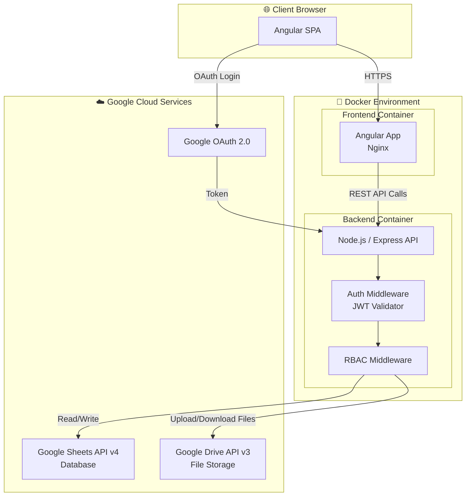

---

### 7.2 Use Case Diagram

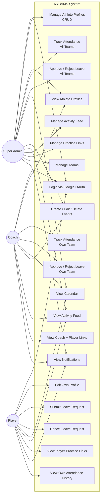

---

### 7.3 Entity Relationship Diagram (ERD)

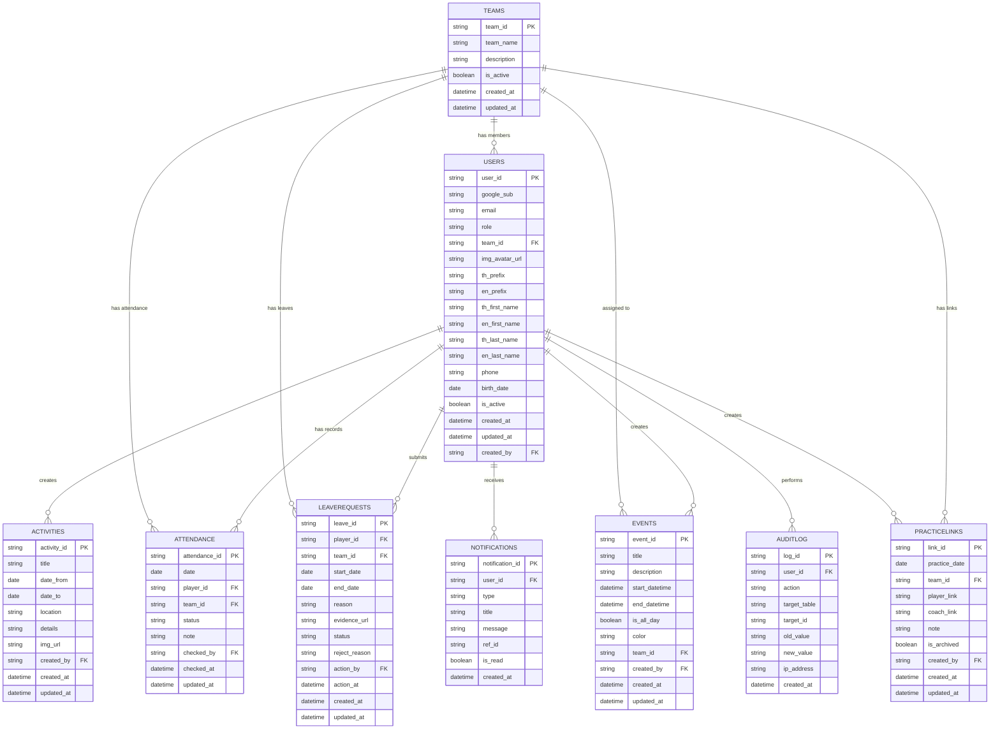

---

### 7.4 Sequence Diagrams

#### 7.4.1 Authentication Flow

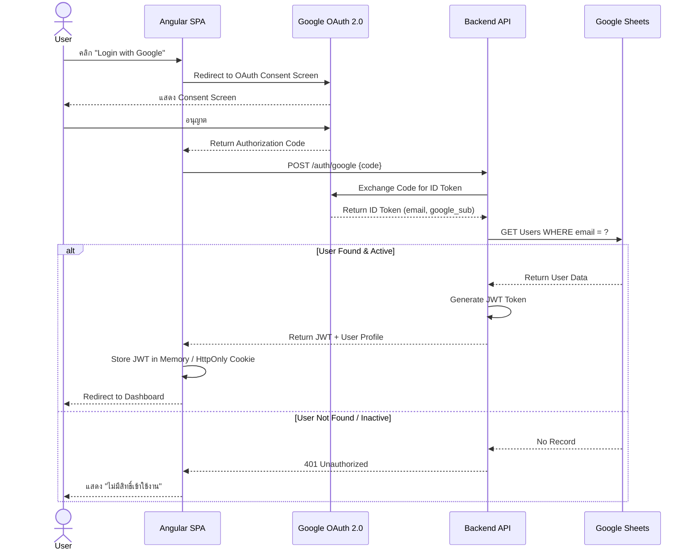

#### 7.4.2 Leave Request Flow

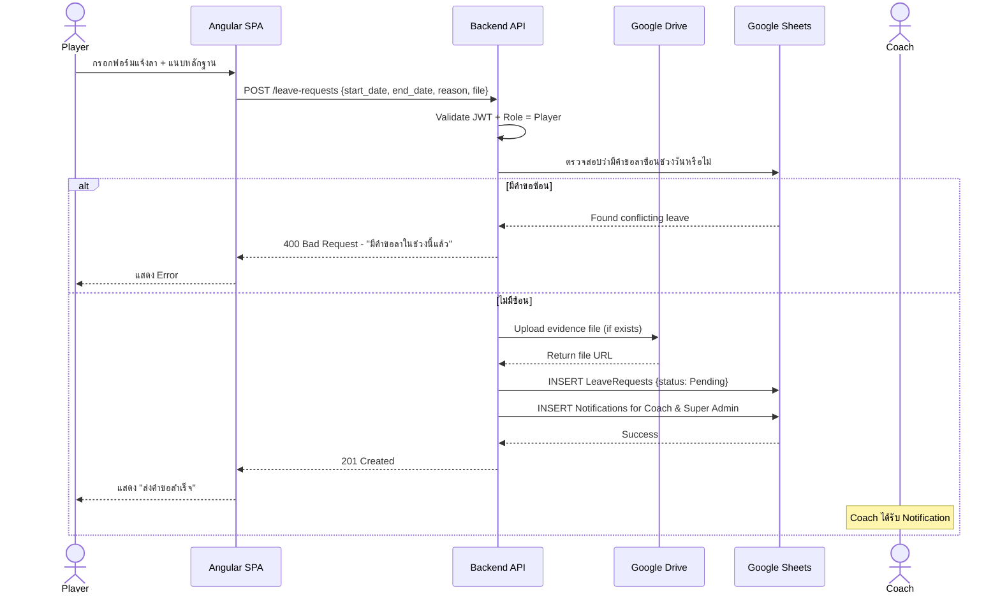

#### 7.4.3 Leave Approval Flow

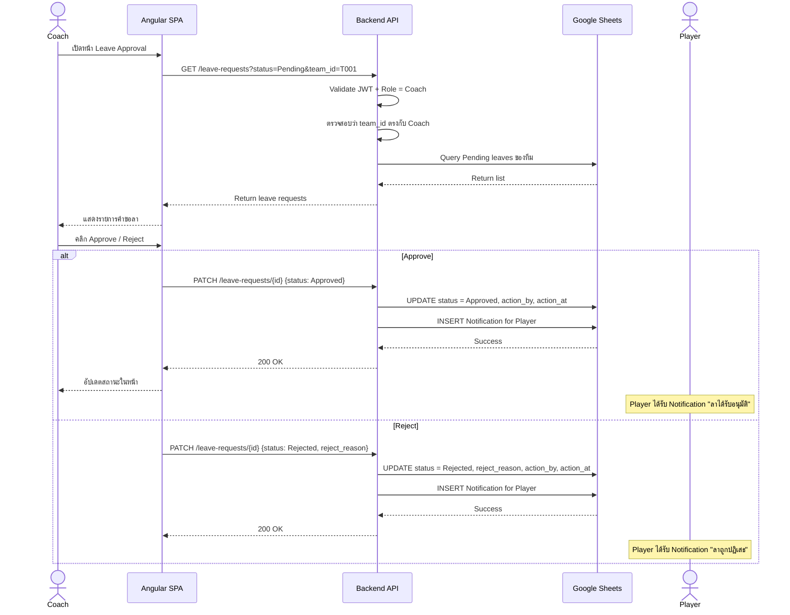

#### 7.4.4 Attendance Tracking Flow

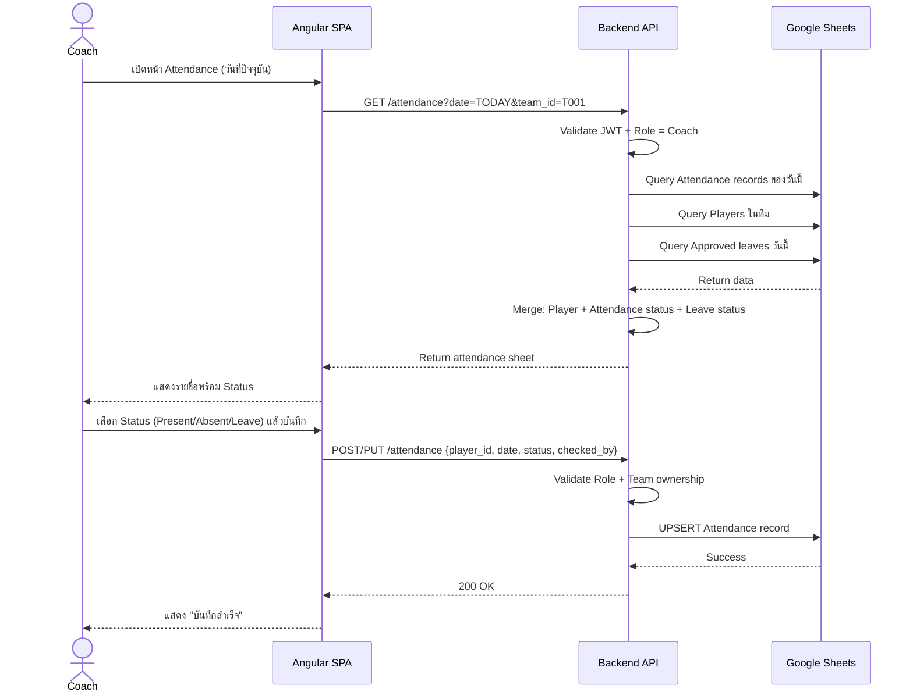

#### 7.4.5 Practice Link Auto-Archive Flow

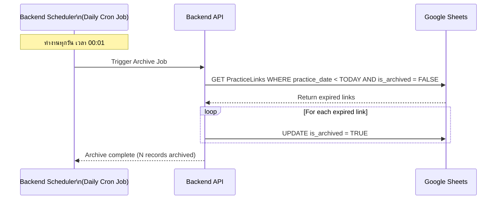

---

### 7.5 Component Diagram

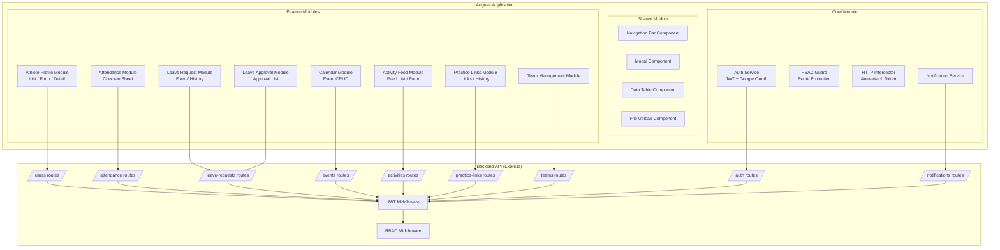

---

### 7.6 Data Flow Diagram (DFD) — Level 1

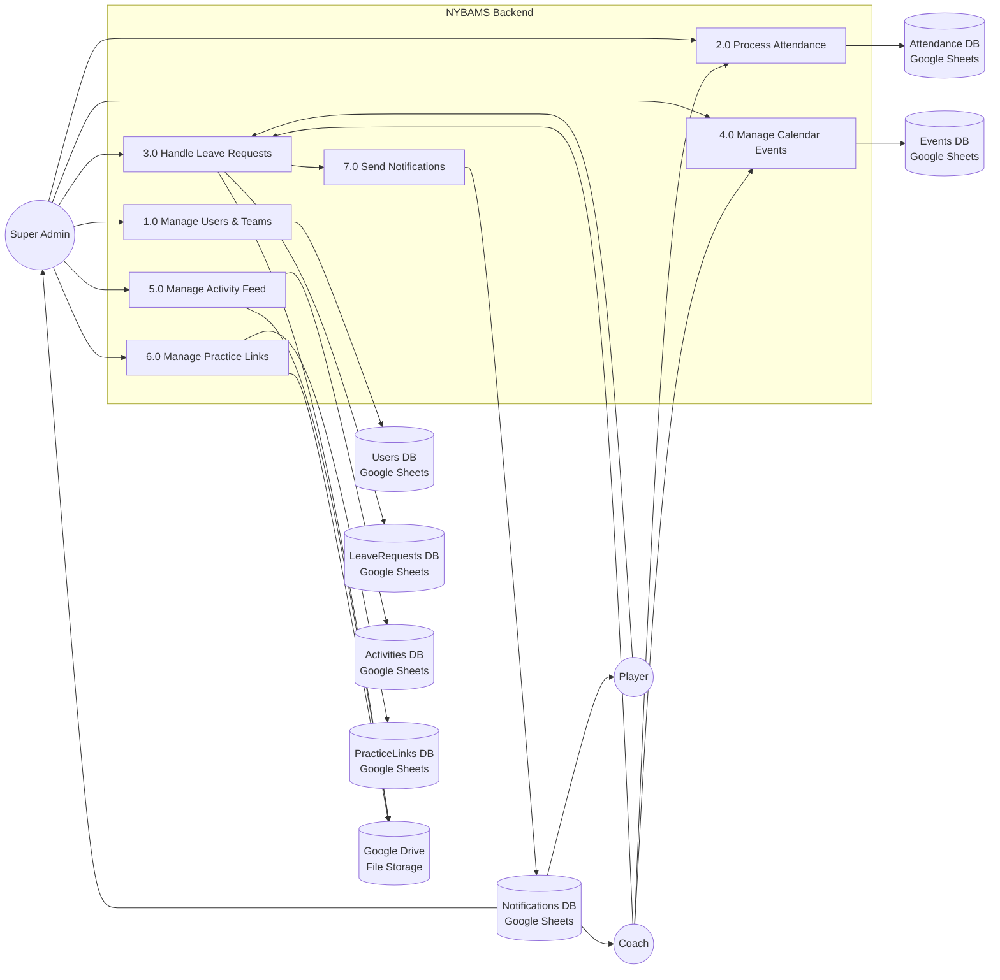

---

### 7.7 Activity Diagrams

#### 7.7.1 Leave Request Activity

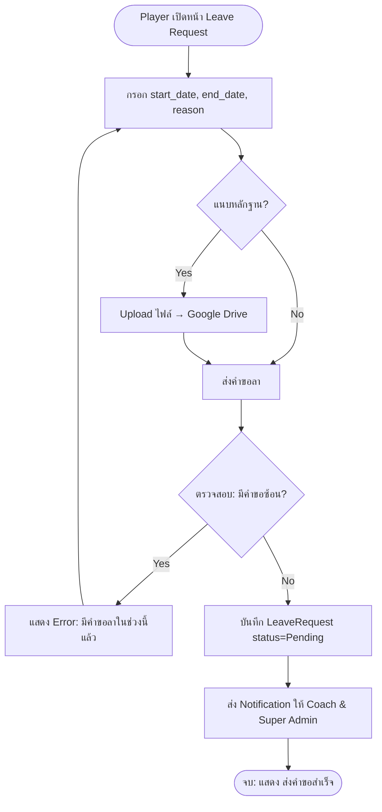

#### 7.7.2 Attendance Tracking Activity

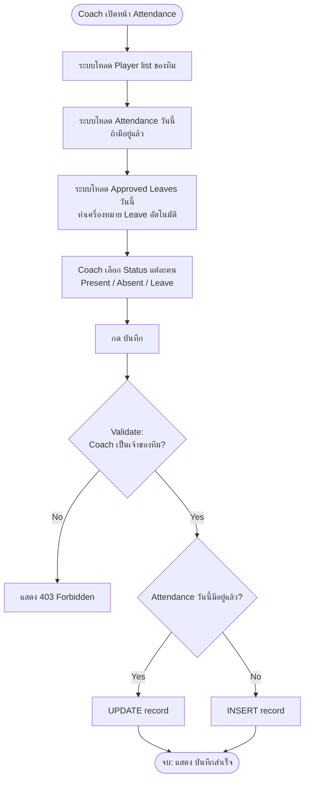

---

## 8. API Endpoint Specification

### Authentication
| Method | Endpoint | Description | Auth |
|---|---|---|---|
| POST | `/api/auth/google` | Exchange Google code for JWT | Public |
| POST | `/api/auth/logout` | Invalidate session | All |

### Users
| Method | Endpoint | Description | Auth |
|---|---|---|---|
| GET | `/api/users` | List all users (with filters) | All |
| POST | `/api/users` | Create new user | Super Admin |
| GET | `/api/users/:id` | Get user detail | All |
| PUT | `/api/users/:id` | Update user | Super Admin / Owner (limited) |
| PATCH | `/api/users/:id/deactivate` | Deactivate user | Super Admin |

### Teams
| Method | Endpoint | Description | Auth |
|---|---|---|---|
| GET | `/api/teams` | List all teams | All |
| POST | `/api/teams` | Create team | Super Admin |
| PUT | `/api/teams/:id` | Update team | Super Admin |
| DELETE | `/api/teams/:id` | Delete team | Super Admin |

### Attendance
| Method | Endpoint | Description | Auth |
|---|---|---|---|
| GET | `/api/attendance` | Get attendance list (filter: date, team) | Coach / Super Admin |
| POST | `/api/attendance` | Create attendance record | Coach / Super Admin |
| PUT | `/api/attendance/:id` | Update attendance | Coach / Super Admin |
| GET | `/api/attendance/my` | Get own attendance history | Player |

### Leave Requests
| Method | Endpoint | Description | Auth |
|---|---|---|---|
| GET | `/api/leave-requests` | Get leave requests (filter: status, team) | Coach / Super Admin |
| POST | `/api/leave-requests` | Submit leave request | Player |
| GET | `/api/leave-requests/my` | Get own leave history | Player |
| PATCH | `/api/leave-requests/:id/cancel` | Cancel pending leave | Player (owner) |
| PATCH | `/api/leave-requests/:id/approve` | Approve leave | Coach / Super Admin |
| PATCH | `/api/leave-requests/:id/reject` | Reject leave | Coach / Super Admin |

### Events
| Method | Endpoint | Description | Auth |
|---|---|---|---|
| GET | `/api/events` | Get events (filter: date range, team) | All |
| POST | `/api/events` | Create event | Coach / Super Admin |
| PUT | `/api/events/:id` | Update event | Creator / Super Admin |
| DELETE | `/api/events/:id` | Delete event | Creator / Super Admin |

### Activities (Feed)
| Method | Endpoint | Description | Auth |
|---|---|---|---|
| GET | `/api/activities` | Get activity feed | All |
| POST | `/api/activities` | Create activity | Super Admin |
| PUT | `/api/activities/:id` | Update activity | Super Admin |
| DELETE | `/api/activities/:id` | Delete activity | Super Admin |

### Practice Links
| Method | Endpoint | Description | Auth |
|---|---|---|---|
| GET | `/api/practice-links` | Get practice links (current) | All |
| GET | `/api/practice-links/history` | Get archived links | All |
| POST | `/api/practice-links` | Add practice link | Super Admin |
| PUT | `/api/practice-links/:id` | Update link | Super Admin |
| DELETE | `/api/practice-links/:id` | Delete link | Super Admin |

### Notifications
| Method | Endpoint | Description | Auth |
|---|---|---|---|
| GET | `/api/notifications/my` | Get own notifications | All |
| PATCH | `/api/notifications/:id/read` | Mark as read | All |
| PATCH | `/api/notifications/read-all` | Mark all as read | All |

---

## 9. Constraints & Assumptions

### Constraints
1. ระบบใช้ Google Sheets เป็นฐานข้อมูล จึงมี Rate Limit จาก Google Sheets API (100 requests/100 วินาที/ผู้ใช้)
2. ขนาดไฟล์ที่อัปโหลดสูงสุด 10 MB ต่อไฟล์ (รองรับ PDF, JPG, PNG)
3. User 1 คน สังกัดได้เพียง 1 ทีมเท่านั้น
4. Coach ไม่สามารถสร้าง/แก้ไข User Profile ได้
5. Player ไม่สามารถแก้ไขชื่อ-นามสกุล, วันเกิด, และ Role ของตัวเองได้

### Assumptions
1. ทุก User มี Google Account ที่ Super Admin ลงทะเบียนไว้ในระบบก่อน
2. การ Deploy ใช้ Docker บน Server ที่มี Network เข้าถึง Google APIs
3. มี Service Account ที่มีสิทธิ์ read/write ใน Google Sheets และ Google Drive
4. Cron Job สำหรับ Auto-Archive Practice Links ทำงานบน Backend Container
5. ระบบ Notification เป็น In-App Notification (ไม่ใช่ Email หรือ Push Notification ในเบื้องต้น)

---

---

### 7.8 State Diagrams

#### 7.8.1 Leave Request Status State Diagram

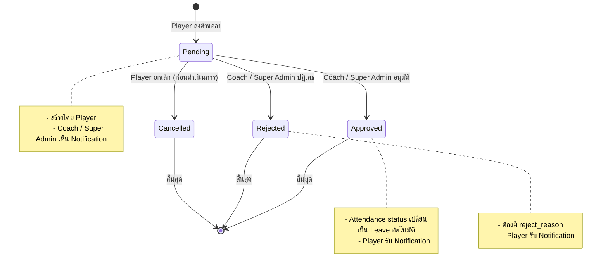

#### 7.8.2 User Account Status State Diagram

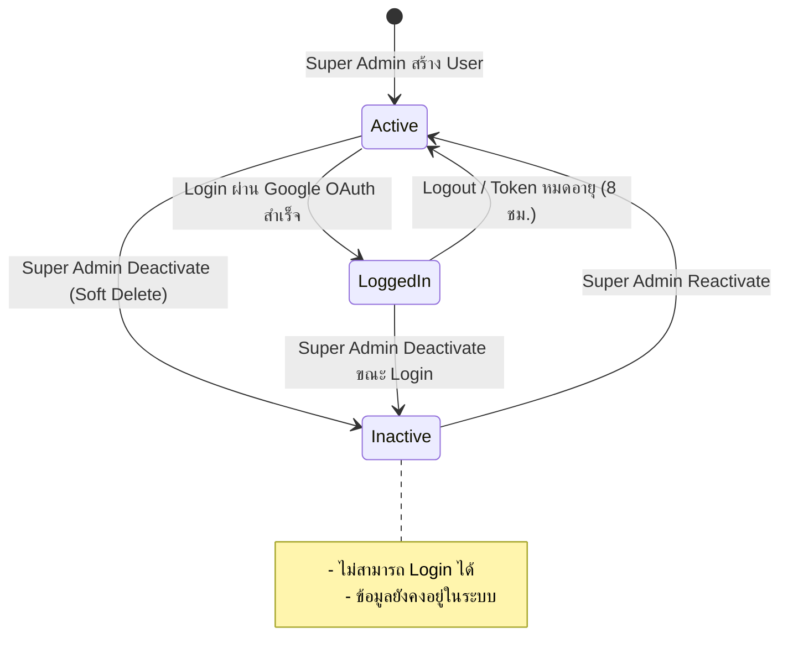

#### 7.8.3 Practice Link Status State Diagram

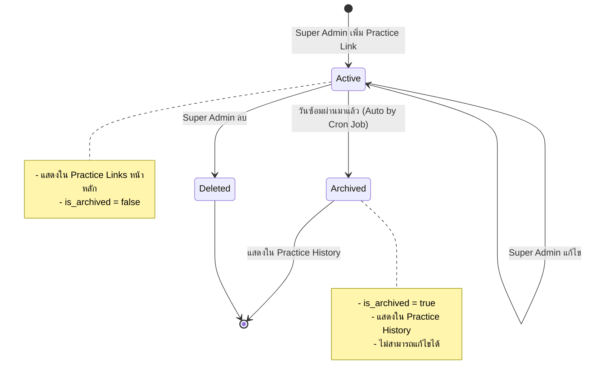

#### 7.8.4 Attendance Status State Diagram

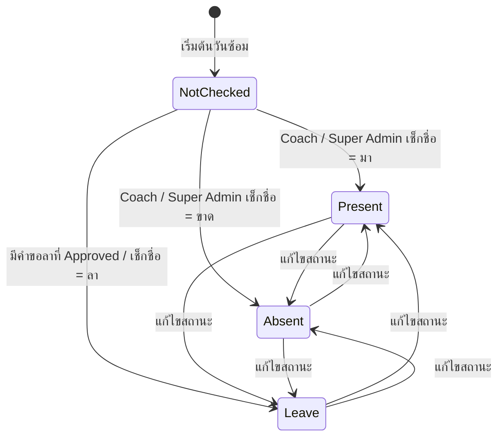

---

### 7.9 Navigation & Sitemap Diagram

```mermaid
graph TD
    LOGIN[🔐 Login Page\nGoogle OAuth] --> DASHBOARD

    DASHBOARD[🏠 Dashboard / Home]

    DASHBOARD --> NAV_ATH[👤 Athlete Profiles]
    DASHBOARD --> NAV_ATT[✅ Attendance]
    DASHBOARD --> NAV_LEAVE[📋 Leave]
    DASHBOARD --> NAV_CAL[📅 Calendar]
    DASHBOARD --> NAV_FEED[📰 Activity Feed]
    DASHBOARD --> NAV_PRAC[🔗 Practice Links]
    DASHBOARD --> NAV_TEAM[🏅 Team Management\nSuper Admin only]
    DASHBOARD --> NAV_NOTI[🔔 Notifications]

    NAV_ATH --> ATH_LIST[Athlete List\nSearch + Filter by Team]
    ATH_LIST --> ATH_DETAIL[Athlete Detail / View]
    ATH_LIST --> ATH_CREATE[Create Athlete Form\nSuper Admin only]
    ATH_DETAIL --> ATH_EDIT[Edit Athlete\nSuper Admin / Owner limited]

    NAV_ATT --> ATT_TODAY[Today Attendance Sheet\nCoach: Own Team\nSuper Admin: All Teams]
    ATT_TODAY --> ATT_HISTORY[Attendance History\nFilter by Date / Team]

    NAV_LEAVE --> LEAVE_MY[My Leave History\nPlayer]
    NAV_LEAVE --> LEAVE_FORM[Submit Leave Request Form\nPlayer]
    NAV_LEAVE --> LEAVE_APPROVE[Leave Approval List\nCoach / Super Admin]
    LEAVE_APPROVE --> LEAVE_DETAIL[Leave Request Detail\nApprove / Reject]

    NAV_CAL --> CAL_MONTH[Calendar - Monthly View]
    CAL_MONTH --> CAL_WEEK[Weekly View]
    CAL_MONTH --> CAL_DAY[Daily View]
    CAL_MONTH --> CAL_EVENT_DETAIL[Event Detail Modal]
    CAL_MONTH --> CAL_EVENT_CREATE[Create Event Modal\nCoach / Super Admin]

    NAV_FEED --> FEED_LIST[Activity Feed List\nAll Users]
    FEED_LIST --> FEED_DETAIL[Activity Detail]
    FEED_LIST --> FEED_CREATE[Create Activity Form\nSuper Admin only]

    NAV_PRAC --> PRAC_CURRENT[Current Practice Links\nFiltered by Role]
    PRAC_CURRENT --> PRAC_HISTORY[Practice History\nArchived Links]
    PRAC_CURRENT --> PRAC_CREATE[Add Practice Link Form\nSuper Admin only]

    NAV_TEAM --> TEAM_LIST[Team List]
    TEAM_LIST --> TEAM_CREATE[Create Team Form]
    TEAM_LIST --> TEAM_EDIT[Edit Team]

    NAV_NOTI --> NOTI_LIST[Notification List\nMark as Read]
```

---

## 10. Field Validation Rules

### 10.1 Users Table — Validation per Field

| Field | Required | Type | Validation Rules |
|---|---|---|---|
| `email` | ✅ | String | Format: valid email, ต้องเป็น Gmail, Unique ใน Users table |
| `role` | ✅ | Enum | ต้องเป็นค่าใดค่าหนึ่ง: `Super Admin`, `Coach`, `Player` |
| `team_id` | ✅ (Coach/Player) | String (FK) | ต้องมีอยู่ใน Teams table; Super Admin อาจเป็น NULL ได้ |
| `th_prefix` | ❌ | String | ค่าที่อนุญาต: `นาย`, `นาง`, `นางสาว`, `เด็กชาย`, `เด็กหญิง` |
| `en_prefix` | ❌ | String | ค่าที่อนุญาต: `Mr.`, `Mrs.`, `Ms.`, `Master`, `Miss` |
| `th_first_name` | ✅ | String | ความยาว 1–50 ตัวอักษร, ภาษาไทยเท่านั้น |
| `en_first_name` | ✅ | String | ความยาว 1–50 ตัวอักษร, ภาษาอังกฤษเท่านั้น |
| `th_last_name` | ✅ | String | ความยาว 1–100 ตัวอักษร, ภาษาไทยเท่านั้น |
| `en_last_name` | ✅ | String | ความยาว 1–100 ตัวอักษร, ภาษาอังกฤษเท่านั้น |
| `phone` | ❌ | String | Format: 10 หลัก, ขึ้นต้นด้วย `0`, เช่น `0812345678` |
| `birth_date` | ❌ | Date | Format: `YYYY-MM-DD`, ต้องไม่อยู่ในอนาคต, อายุ 10–30 ปี |
| `img_avatar_url` | ❌ | String | ต้องเป็น URL จาก Google Drive, ขนาดไฟล์ ≤ 5 MB, รูปแบบ: JPG, PNG |

### 10.2 LeaveRequests Table — Validation per Field

| Field | Required | Type | Validation Rules |
|---|---|---|---|
| `start_date` | ✅ | Date | ต้องไม่ก่อนวันปัจจุบัน (today หรือหลังจากนั้น) |
| `end_date` | ✅ | Date | ต้องไม่ก่อน `start_date` |
| `reason` | ✅ | String | ความยาว 5–500 ตัวอักษร |
| `evidence_url` | ❌ | String | URL จาก Google Drive, ขนาดไฟล์ ≤ 10 MB, รูปแบบ: PDF, JPG, PNG |
| `reject_reason` | เฉพาะกรณี Reject | String | ความยาว 5–300 ตัวอักษร, บังคับเมื่อ status = `Rejected` |
| **Business Rule** | — | — | ห้ามส่งคำขอลาที่มีช่วงวันซ้อนกับคำขอที่มีสถานะ `Pending` หรือ `Approved` |

### 10.3 Events Table — Validation per Field

| Field | Required | Type | Validation Rules |
|---|---|---|---|
| `title` | ✅ | String | ความยาว 1–200 ตัวอักษร |
| `description` | ❌ | String | ความยาวไม่เกิน 1,000 ตัวอักษร |
| `start_datetime` | ✅ | DateTime | Format: `YYYY-MM-DDTHH:mm:ss` |
| `end_datetime` | ✅ | DateTime | ต้องไม่ก่อน `start_datetime` |
| `color` | ❌ | String | Format: Hex Color `#RRGGBB`, default: `#4285F4` |
| `is_all_day` | ❌ | Boolean | Default: `false`; ถ้า `true` จะไม่ใช้เวลา |
| `team_id` | ❌ | String (FK) | ถ้า NULL = Event สำหรับทุกทีม |

### 10.4 PracticeLinks Table — Validation per Field

| Field | Required | Type | Validation Rules |
|---|---|---|---|
| `practice_date` | ✅ | Date | Format: `YYYY-MM-DD` |
| `team_id` | ❌ | String (FK) | ถ้ามีค่าต้องมีอยู่ใน Teams table; `NULL` = ทุกทีมซ้อมร่วมกัน |
| `section` | ✅ | Integer | ค่า 1–99; เรียงลำดับ Section ในวันนั้น; DEFAULT 1 |
| `player_link` | ✅ | String | ต้องเป็น URL ที่ valid (เริ่มต้นด้วย `https://`) |
| `coach_link` | ❌ | String | ต้องเป็น URL ที่ valid ถ้าระบุ |
| `note` | ❌ | String | ความยาวไม่เกิน 500 ตัวอักษร |
| **Business Rule** | — | — | ห้ามสร้าง Practice Link ซ้ำ: (`practice_date` + `team_id` + `section`) ต้องไม่ซ้ำกัน |
| **Business Rule** | — | — | `team_id = NULL` (All Teams) และ `team_id = T001` ถือเป็นคนละ record |

### 10.5 Activities Table — Validation per Field

| Field | Required | Type | Validation Rules |
|---|---|---|---|
| `title` | ✅ | String | ความยาว 1–200 ตัวอักษร |
| `date_from` | ✅ | Date | Format: `YYYY-MM-DD` |
| `date_to` | ✅ | Date | ต้องไม่ก่อน `date_from` |
| `location` | ❌ | String | ความยาวไม่เกิน 300 ตัวอักษร |
| `details` | ✅ | String | ความยาว 10–5,000 ตัวอักษร |
| `img_url` | ❌ | String | URL จาก Google Drive, ขนาดไฟล์ ≤ 10 MB, รูปแบบ: JPG, PNG |

---

## 11. Google Sheets Structure & Configuration

### 11.1 Spreadsheet Organization

ระบบใช้ **Google Sheets Workbook เดียว** แบ่งเป็น 9 Sheets ดังนี้:

| Sheet Name | Table Name | ใช้งาน |
|---|---|---|
| `teams` | Teams | จัดการข้อมูลทีม |
| `users` | Users | จัดการข้อมูลนักกีฬาและโค้ช |
| `attendance` | Attendance | บันทึกการเช็กชื่อ |
| `leave_requests` | LeaveRequests | คำขอลาซ้อม |
| `events` | Events | ปฏิทิน Event |
| `activities` | Activities | Activity Feed |
| `practice_links` | PracticeLinks | ลิงก์การซ้อม Realbridge |
| `notifications` | Notifications | Notification ระบบ |
| `audit_log` | AuditLog | Log การกระทำใน System |

### 11.2 Row Structure Convention

```
Row 1  : Header (Column Names) — ห้ามแก้ไข
Row 2+ : Data Records
```

> **หมายเหตุ:** ต้อง **Freeze Row 1** ใน Google Sheets ทุก Sheet เพื่อป้องกันการแก้ไข Header โดยไม่ตั้งใจ

### 11.3 ID Generation Strategy

เนื่องจาก Google Sheets ไม่มี Auto-Increment ID แบบ RDBMS ระบบจะสร้าง ID ดังนี้:

```
Format:  [PREFIX][TIMESTAMP][RANDOM]
Example:
  user_id       → U20260529A1B2
  team_id       → T20260529C3D4
  attendance_id → ATT20260529E5F6
  leave_id      → LV20260529G7H8
  event_id      → EVT20260529I9J0
  activity_id   → ACT20260529K1L2
  link_id       → PL20260529M3N4
  notification_id → NOTI20260529O5P6
  log_id        → LOG20260529Q7R8
```

### 11.4 Google Service Account Permissions

| Permission | Scope | Purpose |
|---|---|---|
| Google Sheets API | `https://www.googleapis.com/auth/spreadsheets` | Read/Write ข้อมูลทุก Sheet |
| Google Drive API | `https://www.googleapis.com/auth/drive.file` | Upload/Read ไฟล์ที่ App สร้าง |
| Google OAuth | `openid email profile` | Authentication ผู้ใช้งาน |

### 11.5 Google Drive Folder Structure

```
📁 NYBAMS-Storage/                         (Root Folder - Service Account Owner)
├── 📁 avatars/                            (รูปโปรไฟล์)
│   ├── U001_avatar.jpg
│   └── U002_avatar.png
├── 📁 leave-evidence/                     (หลักฐานการลา)
│   ├── LV20260529G7H8_evidence.pdf
│   └── LV20260529A1B2_evidence.jpg
└── 📁 activity-images/                    (รูปประกอบกิจกรรม)
    ├── ACT20260529K1L2_cover.jpg
    └── ACT20260529M3N4_cover.png
```

### 11.6 Google Sheets API Rate Limit Strategy

| ปัญหา | กลยุทธ์แก้ไข |
|---|---|
| Rate Limit 100 req / 100s | ใช้ **Batch Requests** (batchGet / batchUpdate) แทนการเรียกทีละ row |
| Concurrent Write Conflicts | ใช้ **Exponential Backoff** retry เมื่อ API ตอบกลับ 429 |
| Large Data Reads | Cache ข้อมูลที่ไม่เปลี่ยนบ่อย (เช่น Teams) ใน Backend Memory 5 นาที |

---

## 12. Docker & Deployment Configuration

### 12.1 Docker Compose Structure

```yaml
# docker-compose.yml
version: '3.9'

services:
  frontend:
    build:
      context: ./frontend
      dockerfile: Dockerfile
    container_name: nybams-frontend
    ports:
      - "80:80"
      - "443:443"
    depends_on:
      - backend
    environment:
      - API_BASE_URL=http://backend:3000
    networks:
      - nybams-network
    restart: unless-stopped

  backend:
    build:
      context: ./backend
      dockerfile: Dockerfile
    container_name: nybams-backend
    ports:
      - "3000:3000"
    environment:
      - NODE_ENV=production
      - PORT=3000
    env_file:
      - .env
    networks:
      - nybams-network
    restart: unless-stopped
    volumes:
      - ./credentials:/app/credentials:ro   # Google Service Account Key

networks:
  nybams-network:
    driver: bridge
```

### 12.2 Frontend Dockerfile

```dockerfile
# frontend/Dockerfile
FROM node:20-alpine AS builder
WORKDIR /app
COPY package*.json ./
RUN npm ci
COPY . .
RUN npm run build -- --configuration production

FROM nginx:alpine
COPY --from=builder /app/dist/nybams-frontend /usr/share/nginx/html
COPY nginx.conf /etc/nginx/conf.d/default.conf
EXPOSE 80
CMD ["nginx", "-g", "daemon off;"]
```

### 12.3 Backend Dockerfile

```dockerfile
# backend/Dockerfile
FROM node:20-alpine AS builder
WORKDIR /app
COPY package*.json ./
RUN npm ci
COPY . .
RUN npm run build

FROM node:20-alpine
WORKDIR /app
COPY --from=builder /app/dist ./dist
COPY --from=builder /app/node_modules ./node_modules
EXPOSE 3000
CMD ["node", "dist/main.js"]
```

### 12.4 Nginx Configuration

```nginx
# frontend/nginx.conf
server {
    listen 80;
    server_name _;
    root /usr/share/nginx/html;
    index index.html;

    # Angular SPA — Redirect all routes to index.html
    location / {
        try_files $uri $uri/ /index.html;
    }

    # Proxy API calls to Backend container
    location /api/ {
        proxy_pass http://backend:3000/api/;
        proxy_http_version 1.1;
        proxy_set_header Upgrade $http_upgrade;
        proxy_set_header Connection 'upgrade';
        proxy_set_header Host $host;
        proxy_cache_bypass $http_upgrade;
    }

    # Gzip compression
    gzip on;
    gzip_types text/plain application/javascript application/json text/css;
}
```

### 12.5 Deployment Commands

```bash
# Development
docker-compose -f docker-compose.dev.yml up --build

# Production
docker-compose up -d --build

# View logs
docker-compose logs -f backend
docker-compose logs -f frontend

# Stop services
docker-compose down

# Rebuild single service
docker-compose up -d --build backend
```

### 12.6 Health Check

```
GET /api/health
Response 200: { "status": "ok", "timestamp": "2026-05-29T10:00:00Z" }
```

---

## 13. Error Handling & HTTP Response Codes

### 13.1 Standard API Response Format

```json
// Success
{
  "success": true,
  "data": { ... },
  "message": "Operation completed successfully"
}

// Error
{
  "success": false,
  "error": {
    "code": "LEAVE_CONFLICT",
    "message": "มีคำขอลาในช่วงวันที่ระบุอยู่แล้ว",
    "details": { "conflicting_leave_id": "LV2026..." }
  }
}
```

### 13.2 HTTP Status Codes

| Status Code | ความหมาย | กรณีที่ใช้ |
|---|---|---|
| `200 OK` | สำเร็จ | GET, PUT, PATCH ที่สำเร็จ |
| `201 Created` | สร้างสำเร็จ | POST ที่สร้างข้อมูลใหม่ |
| `204 No Content` | สำเร็จ ไม่มี Body | DELETE ที่สำเร็จ |
| `400 Bad Request` | ข้อมูลไม่ถูกต้อง | Validation ล้มเหลว |
| `401 Unauthorized` | ไม่มี / Token ไม่ถูกต้อง | ไม่ได้ Login |
| `403 Forbidden` | ไม่มีสิทธิ์ | Role ไม่อนุญาต / ทีมไม่ตรง |
| `404 Not Found` | ไม่พบข้อมูล | ID ไม่มีในระบบ |
| `409 Conflict` | ข้อมูลซ้ำ | Leave ซ้อนกัน, Attendance ซ้ำ |
| `429 Too Many Requests` | Rate limit | Google Sheets API limit |
| `500 Internal Server Error` | ข้อผิดพลาดของ Server | Google API error, ข้อผิดพลาดอื่น |

### 13.3 Business Error Codes

| Error Code | HTTP | คำอธิบาย |
|---|---|---|
| `AUTH_ACCOUNT_NOT_FOUND` | 401 | Google Account นี้ไม่ได้ลงทะเบียนในระบบ |
| `AUTH_ACCOUNT_INACTIVE` | 401 | Account ถูก Deactivate |
| `AUTH_TOKEN_EXPIRED` | 401 | JWT Token หมดอายุ |
| `RBAC_FORBIDDEN` | 403 | Role ไม่มีสิทธิ์ดำเนินการ |
| `RBAC_WRONG_TEAM` | 403 | Coach พยายามเข้าถึงข้อมูลทีมอื่น |
| `USER_NOT_FOUND` | 404 | ไม่พบ User ที่ระบุ |
| `TEAM_NOT_FOUND` | 404 | ไม่พบ Team ที่ระบุ |
| `TEAM_HAS_MEMBERS` | 409 | ไม่สามารถลบทีมที่ยังมีสมาชิก |
| `LEAVE_CONFLICT` | 409 | มีคำขอลาซ้อนกับช่วงวันที่ระบุ |
| `LEAVE_NOT_PENDING` | 409 | คำขอลาไม่ได้อยู่ใน Pending status |
| `ATTENDANCE_ALREADY_EXISTS` | 409 | มีการเช็กชื่อวันนี้แล้ว (ใช้ PUT แทน) |
| `PRACTICE_LINK_DUPLICATE` | 409 | มี Practice Link ของทีมนี้ในวันนี้แล้ว |
| `PRACTICE_LINK_ARCHIVED` | 409 | ไม่สามารถแก้ไข Link ที่ถูก Archive แล้ว |
| `FILE_TOO_LARGE` | 400 | ขนาดไฟล์เกิน 10 MB |
| `FILE_TYPE_NOT_ALLOWED` | 400 | ประเภทไฟล์ไม่รองรับ |
| `LEAVE_DATE_IN_PAST` | 400 | วันเริ่มลาอยู่ก่อนวันปัจจุบัน |
| `REJECT_REASON_REQUIRED` | 400 | ต้องระบุเหตุผลเมื่อ Reject การลา |
| `GOOGLE_SHEETS_ERROR` | 500 | ไม่สามารถติดต่อ Google Sheets API |
| `GOOGLE_DRIVE_ERROR` | 500 | ไม่สามารถติดต่อ Google Drive API |

### 13.4 Frontend Error Handling Strategy

| สถานการณ์ | การจัดการ |
|---|---|
| 401 Token หมดอายุ | Auto-refresh หรือ Redirect ไป Login |
| 403 Forbidden | แสดง Toast "ไม่มีสิทธิ์ดำเนินการ" |
| 404 Not Found | แสดงหน้า 404 หรือ Toast แจ้งเตือน |
| 409 Conflict | แสดง Dialog อธิบายสาเหตุ |
| 429 Rate Limit | Retry อัตโนมัติ 3 ครั้งด้วย Exponential Backoff |
| 500 Server Error | แสดง Toast "เกิดข้อผิดพลาด กรุณาลองใหม่อีกครั้ง" + Log ใน Console |
| Network Error | แสดง Toast "ไม่สามารถเชื่อมต่อ Server" |

---

## 14. Environment Variables

### 14.1 Backend `.env` File

```env
# ============================================================
# NYBAMS Backend Environment Variables
# ============================================================

# Application
NODE_ENV=production
PORT=3000
APP_NAME=NYBAMS
APP_VERSION=2.0.0

# JWT Configuration
JWT_SECRET=your-strong-random-secret-key-min-32-chars
JWT_EXPIRES_IN=8h

# Google OAuth 2.0
GOOGLE_CLIENT_ID=your-google-oauth-client-id.apps.googleusercontent.com
GOOGLE_CLIENT_SECRET=your-google-oauth-client-secret
GOOGLE_REDIRECT_URI=https://yourdomain.com/api/auth/google/callback

# Google Sheets
GOOGLE_SHEETS_SPREADSHEET_ID=your-spreadsheet-id
GOOGLE_SERVICE_ACCOUNT_KEY_PATH=/app/credentials/service-account.json

# Google Drive
GOOGLE_DRIVE_ROOT_FOLDER_ID=your-root-folder-id

# CORS
CORS_ORIGIN=https://yourdomain.com

# File Upload Limits
MAX_FILE_SIZE_MB=10
ALLOWED_FILE_TYPES=image/jpeg,image/png,application/pdf

# Cron Job (Auto-Archive Practice Links)
CRON_ARCHIVE_SCHEDULE=0 1 * * *

# Rate Limiting
RATE_LIMIT_WINDOW_MS=60000
RATE_LIMIT_MAX_REQUESTS=100
```

### 14.2 Frontend `environment.ts`

```typescript
// src/environments/environment.prod.ts
export const environment = {
  production: true,
  apiBaseUrl: 'https://yourdomain.com/api',
  googleClientId: 'your-google-oauth-client-id.apps.googleusercontent.com',
  appName: 'NYBAMS',
  version: '2.0.0',
  pagination: {
    defaultPageSize: 20,
    pageSizeOptions: [10, 20, 50]
  },
  cache: {
    teamsCacheDurationMs: 300000  // 5 minutes
  }
};
```

---

## 15. Testing Requirements

### 15.1 Unit Testing

| Module | Coverage Target | Tools |
|---|---|---|
| Backend API Controllers | ≥ 80% | Jest |
| Backend Service Layer | ≥ 85% | Jest |
| RBAC Middleware | ≥ 95% | Jest |
| Angular Components | ≥ 70% | Jasmine + Karma |
| Angular Services | ≥ 80% | Jasmine + Karma |

### 15.2 Integration Testing

| Test Scenario | Priority |
|---|---|
| Google OAuth login flow (valid/invalid email) | 🔴 Critical |
| Leave request conflict detection | 🔴 Critical |
| RBAC enforcement for all endpoints | 🔴 Critical |
| Attendance upsert (insert + update) | 🟡 High |
| Practice Link auto-archive (Cron Job) | 🟡 High |
| File upload to Google Drive | 🟡 High |
| Notification creation on leave approval | 🟢 Medium |
| Pagination and filtering | 🟢 Medium |

### 15.3 Key Test Cases

#### Authentication
```
TC-AUTH-01: Login ด้วย Email ที่มีในระบบ + is_active=true → สำเร็จ รับ JWT
TC-AUTH-02: Login ด้วย Email ที่มีในระบบ + is_active=false → 401 AUTH_ACCOUNT_INACTIVE
TC-AUTH-03: Login ด้วย Email ที่ไม่มีในระบบ → 401 AUTH_ACCOUNT_NOT_FOUND
TC-AUTH-04: เรียก API โดยไม่มี Token → 401
TC-AUTH-05: เรียก API ด้วย Token ที่หมดอายุ → 401 AUTH_TOKEN_EXPIRED
```

#### RBAC
```
TC-RBAC-01: Player เรียก GET /api/attendance → 403 RBAC_FORBIDDEN
TC-RBAC-02: Coach เรียก POST /api/users → 403 RBAC_FORBIDDEN
TC-RBAC-03: Coach เรียก GET /api/attendance?team_id=[OTHER_TEAM] → 403 RBAC_WRONG_TEAM
TC-RBAC-04: Super Admin เรียก GET /api/attendance?team_id=[ANY] → 200
TC-RBAC-05: Player เรียก GET /api/users/:id → 200 (ข้อมูล phone/birth_date ถูกซ่อน)
```

#### Leave Request
```
TC-LV-01: ส่งคำขอลาช่วงวันที่ไม่ซ้อน → 201 Created
TC-LV-02: ส่งคำขอลาซ้อนกับ Pending leave → 409 LEAVE_CONFLICT
TC-LV-03: ส่งคำขอลาซ้อนกับ Approved leave → 409 LEAVE_CONFLICT
TC-LV-04: ส่งคำขอลา start_date ก่อนวันนี้ → 400 LEAVE_DATE_IN_PAST
TC-LV-05: Reject leave โดยไม่ระบุ reject_reason → 400 REJECT_REASON_REQUIRED
TC-LV-06: Coach Approve leave ของทีมตัวเอง → 200 OK
TC-LV-07: Coach Approve leave ของทีมอื่น → 403 RBAC_WRONG_TEAM
TC-LV-08: Player ยกเลิกคำขอที่ status=Approved → 409 LEAVE_NOT_PENDING
```

#### Practice Links
```
TC-PL-01: สร้าง Practice Link วันใหม่ → 201 Created
TC-PL-02: สร้าง Practice Link ซ้ำทีม+วันเดียวกัน → 409 PRACTICE_LINK_DUPLICATE
TC-PL-03: Player ขอดู coach_link → response ไม่มี coach_link field
TC-PL-04: Cron Job Archive: link วันที่ผ่านมา is_archived เปลี่ยนเป็น true
TC-PL-05: แก้ไข Practice Link ที่ is_archived=true → 409 PRACTICE_LINK_ARCHIVED
```

### 15.4 Performance Testing

| Scenario | Target |
|---|---|
| Load Page (Athlete List 100+ users) | < 3 วินาที |
| Submit Leave Request (with file upload 5MB) | < 5 วินาที |
| Get Attendance Sheet (30 players) | < 2 วินาที |
| Concurrent Users (10 users พร้อมกัน) | ไม่มี Error |

---

## 16. Project Folder Structure

```
nybams/
├── 📁 frontend/                          # Angular Application
│   ├── 📁 src/
│   │   ├── 📁 app/
│   │   │   ├── 📁 core/                  # Singleton Services & Guards
│   │   │   │   ├── 📁 guards/
│   │   │   │   │   ├── auth.guard.ts
│   │   │   │   │   └── role.guard.ts
│   │   │   │   ├── 📁 interceptors/
│   │   │   │   │   ├── auth.interceptor.ts    # Auto-attach JWT
│   │   │   │   │   └── error.interceptor.ts   # Global Error Handler
│   │   │   │   ├── 📁 services/
│   │   │   │   │   ├── auth.service.ts
│   │   │   │   │   └── notification.service.ts
│   │   │   │   └── core.module.ts
│   │   │   │
│   │   │   ├── 📁 shared/                # Shared Components & Pipes
│   │   │   │   ├── 📁 components/
│   │   │   │   │   ├── navbar/
│   │   │   │   │   ├── data-table/
│   │   │   │   │   ├── file-upload/
│   │   │   │   │   ├── confirm-dialog/
│   │   │   │   │   └── loading-spinner/
│   │   │   │   ├── 📁 pipes/
│   │   │   │   │   └── mask-sensitive.pipe.ts
│   │   │   │   └── shared.module.ts
│   │   │   │
│   │   │   ├── 📁 features/              # Feature Modules (Lazy Loaded)
│   │   │   │   ├── 📁 auth/
│   │   │   │   │   └── login/
│   │   │   │   ├── 📁 athlete-profile/
│   │   │   │   │   ├── athlete-list/
│   │   │   │   │   ├── athlete-detail/
│   │   │   │   │   └── athlete-form/
│   │   │   │   ├── 📁 attendance/
│   │   │   │   │   ├── attendance-sheet/
│   │   │   │   │   └── attendance-history/
│   │   │   │   ├── 📁 leave/
│   │   │   │   │   ├── leave-request-form/
│   │   │   │   │   ├── leave-history/
│   │   │   │   │   └── leave-approval/
│   │   │   │   ├── 📁 calendar/
│   │   │   │   ├── 📁 activity-feed/
│   │   │   │   ├── 📁 practice-links/
│   │   │   │   └── 📁 team-management/
│   │   │   │
│   │   │   ├── 📁 models/                # TypeScript Interfaces
│   │   │   │   ├── user.model.ts
│   │   │   │   ├── team.model.ts
│   │   │   │   ├── attendance.model.ts
│   │   │   │   ├── leave-request.model.ts
│   │   │   │   ├── event.model.ts
│   │   │   │   ├── activity.model.ts
│   │   │   │   ├── practice-link.model.ts
│   │   │   │   └── notification.model.ts
│   │   │   │
│   │   │   ├── app.component.ts
│   │   │   ├── app.module.ts
│   │   │   └── app-routing.module.ts
│   │   │
│   │   ├── 📁 assets/
│   │   ├── 📁 environments/
│   │   │   ├── environment.ts
│   │   │   └── environment.prod.ts
│   │   └── styles.scss
│   │
│   ├── Dockerfile
│   ├── nginx.conf
│   └── package.json
│
├── 📁 backend/                           # Node.js / Express API
│   ├── 📁 src/
│   │   ├── 📁 config/
│   │   │   ├── google-sheets.config.ts
│   │   │   └── google-drive.config.ts
│   │   │
│   │   ├── 📁 middleware/
│   │   │   ├── auth.middleware.ts         # JWT Verification
│   │   │   ├── rbac.middleware.ts         # Role-Based Access Control
│   │   │   └── upload.middleware.ts       # Multer File Upload
│   │   │
│   │   ├── 📁 routes/
│   │   │   ├── auth.routes.ts
│   │   │   ├── users.routes.ts
│   │   │   ├── teams.routes.ts
│   │   │   ├── attendance.routes.ts
│   │   │   ├── leave-requests.routes.ts
│   │   │   ├── events.routes.ts
│   │   │   ├── activities.routes.ts
│   │   │   ├── practice-links.routes.ts
│   │   │   └── notifications.routes.ts
│   │   │
│   │   ├── 📁 controllers/
│   │   │   ├── auth.controller.ts
│   │   │   ├── users.controller.ts
│   │   │   ├── teams.controller.ts
│   │   │   ├── attendance.controller.ts
│   │   │   ├── leave-requests.controller.ts
│   │   │   ├── events.controller.ts
│   │   │   ├── activities.controller.ts
│   │   │   ├── practice-links.controller.ts
│   │   │   └── notifications.controller.ts
│   │   │
│   │   ├── 📁 services/
│   │   │   ├── google-sheets.service.ts   # Base CRUD for Sheets
│   │   │   ├── google-drive.service.ts    # File Upload/Delete
│   │   │   ├── auth.service.ts
│   │   │   ├── users.service.ts
│   │   │   ├── teams.service.ts
│   │   │   ├── attendance.service.ts
│   │   │   ├── leave-requests.service.ts
│   │   │   ├── events.service.ts
│   │   │   ├── activities.service.ts
│   │   │   ├── practice-links.service.ts
│   │   │   └── notifications.service.ts
│   │   │
│   │   ├── 📁 jobs/
│   │   │   └── archive-practice-links.job.ts  # Cron Job
│   │   │
│   │   ├── 📁 utils/
│   │   │   ├── id-generator.ts
│   │   │   ├── date-helper.ts
│   │   │   └── response-formatter.ts
│   │   │
│   │   ├── 📁 models/
│   │   │   └── (TypeScript interfaces — shared with frontend ideally)
│   │   │
│   │   └── main.ts                        # Entry Point
│   │
│   ├── 📁 credentials/
│   │   └── service-account.json           # Google Service Account Key (gitignored)
│   │
│   ├── Dockerfile
│   ├── package.json
│   └── tsconfig.json
│
├── docker-compose.yml
├── docker-compose.dev.yml
├── .env                                   # gitignored
├── .env.example
├── .gitignore
└── README.md
```

---

## 17. Changelog

| Version | Date | Author | Changes |
|---|---|---|---|
| 1.0 | 2026-05-01 | ทีมพัฒนา | Initial draft from user requirements |
| 2.0 | 2026-05-29 | ทีมพัฒนา | เพิ่ม: Notification System, AuditLog table, State Diagrams, Sitemap, Validation Rules, Google Sheets Config, Docker Config, Error Handling, ENV Variables, Testing Requirements, Folder Structure |

---

*เอกสารนี้จัดทำโดยทีมพัฒนา NYBAMS | Version 2.0 | 2026-05-29*  
*ลิขสิทธิ์ © 2026 National Youth Bridge Athlete Management System. All rights reserved.*
